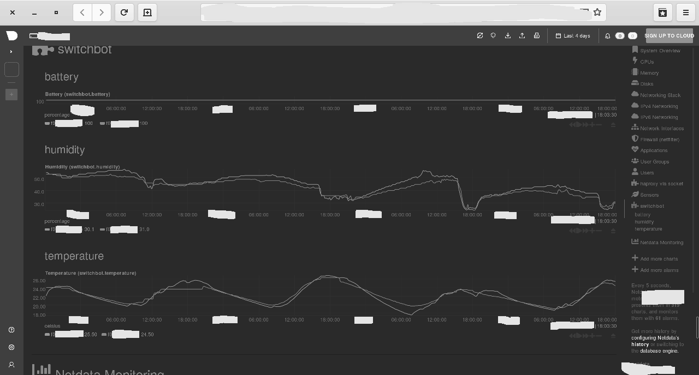

# switchbot-meter-statsd

Scans your Bluetooth adapter for nearby Switchbot thermometers and reports them
over Statsd protocol. I use it to publish the readouts to Netdata so it can be
plotted in the dashboard.

## Screenshot

